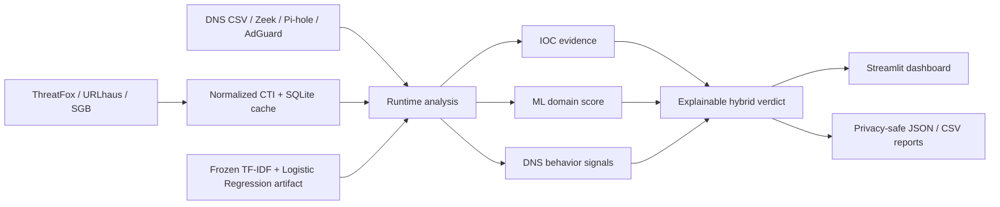

# ThreatFusion AI

AI-assisted multi-source cyber threat intelligence and DNS threat-analysis platform.

ThreatFusion AI combines public threat intelligence, local DNS telemetry,
machine-learning domain scoring, and explainable DNS behavior signals. It is
designed as a portfolio-quality educational security prototype rather than a
replacement for a production SIEM or EDR.

## What it does

The current runtime flow is:

```text
ThreatFox / URLhaus / SGB
          |
          v
   Local CTI cache
          |
DNS CSV / Zeek dns.log / Pi-hole FTL DB / AdGuard Home
          -> IOC matching
          + ML domain scoring
          + DNS behavior analysis
          |
          v
  Explainable hybrid verdict
          |
          v
known_threat / high_risk / review / low
```

Exact known-domain IOC matches take precedence and produce the Known Threat
verdict. URL-hostname and response-IP IOC matches remain deterministic CTI
context but do not, by themselves, prove that the queried domain is malicious.
ML is used as an additional signal for previously unseen domains, and DNS
behavior can strengthen an assessment or trigger review. Behavioral signals are
not treated as proof of malware.

## Architecture overview



The architecture stays intentionally compact:

- **Collection + normalization:** ThreatFox, URLhaus, and SGB IOC ingestion into a common model.
- **Runtime analysis:** local DNS telemetry parsing, deterministic IOC matching, ML scoring, and behavior signals.
- **Persistence:** local SQLite CTI cache, optional local analysis history, and trusted local model artifacts.
- **Presentation:** Streamlit analyst dashboard and privacy-safe JSON/CSV report export.

See `docs/ARCHITECTURE.md` for full data-flow and module-level details.

## Implemented

- ThreatFox, URLhaus, and SGB collectors
- common IOC model, normalization, and correlation
- DNS CSV, Zeek `dns.log`, in-memory Pi-hole FTL database, and AdGuard Home query-log ingestion with aggregate input-quality diagnostics
- known domain / URL-hostname / response-IP / IPv6-network matching with evidence-scope metadata
- reproducible ML dataset snapshots
- character n-gram TF-IDF + Logistic Regression development model
- validation-only threshold selection under explicit false-positive budgets
- source-wise ML diagnostics
- frozen-model fresh holdout evaluation workflow and aggregate JSON reporting
- trusted local model artifact persistence
- DNS behavior aggregation
- explainable hybrid verdicts
- reusable runtime analysis pipeline
- SQLite CTI cache
- privacy-conscious SQLite analysis history with local analyst feedback, prior-review context, and expiring local triage suppression
- analyst-focused Streamlit dashboard with priority triage, evidence-first domain investigation, multi-source CTI corroboration, filtered history, and a dedicated model-evaluation view
- explainable related-activity clustering
- privacy-preserving relationship graph
- public-mode privacy controls and non-root Docker packaging
- privacy-safe JSON/CSV analysis report export with spreadsheet-safe CSV cells
- bounded runtime analysis, IDNA/punycode canonicalization, and strict ML eligibility filtering for valid public-domain candidates, with explicit Not-scored presentation
- CTI freshness/staleness visibility
- sparse evidence-driven related-activity pair generation with bounded and optimized timestamp comparison
- CI coverage across Ubuntu quality checks, Windows pytest compatibility, and Docker build/health smoke validation

## CI checks

- **Quality (Ubuntu):** installs dependencies, runs Ruff, runs pytest with
  coverage reporting, and runs `pip-audit` against `requirements.txt`.
- **Pytest (Windows, Python 3.12):** verifies cross-platform pytest behavior on
  the supported Windows runtime without requiring local CTI API credentials.
- **Docker build + health:** builds the image, starts the app in public mode,
  and verifies the Streamlit health endpoint.

## Python package installation

ThreatFusion uses a standard `src/` package layout with metadata in
`pyproject.toml`. For the repository's tested environment, install the pinned
lock snapshot first and then install the local package without re-resolving
dependencies:

```powershell
py -3.12 -m venv .venv
.\.venv\Scripts\Activate.ps1
python -m pip install --upgrade pip
python -m pip install -r requirements.txt
python -m pip install --no-deps -e .
```

After the editable install, the analyzer is available as a normal command:

```powershell
threatfusion --help
threatfusion data\demo\demo_dns.csv --format dns-csv
```

The legacy repository command remains supported:

```powershell
python scripts\analyze_dns.py data\demo\demo_dns.csv --format dns-csv
```

Dependency files have distinct roles:

- `pyproject.toml`: package metadata and direct runtime dependencies.
- `requirements.in`: human-maintained direct runtime dependency list.
- `requirements-dev.in`: human-maintained direct development/quality tools.
- `requirements.txt`: fully pinned tested environment used by CI and Docker.

Keeping the pinned environment separate from direct dependency declarations
prevents package metadata from becoming a copy of every transitive dependency.

## Local dashboard

The dashboard expects:

- a trusted local model artifact at `data/models/development-001`
- a local SQLite database at `data/threatfusion.sqlite`

Refresh the CTI cache (the refresh is rejected before cache replacement if an expected source unexpectedly returns zero records):

```powershell
$env:THREATFOX_AUTH_KEY="..."
$env:URLHAUS_AUTH_KEY="..."
python scripts\refresh_cti_cache.py
```

Generate a safe local demo DNS CSV:

```powershell
python scripts\generate_demo_dns_csv.py
```

This creates `data/demo/demo_dns.csv`. If the local CTI cache contains at
least one domain IOC, the demo includes one cached IOC value as inert text so
the known-threat matching path can be exercised. The generator does not print,
visit, or resolve that IOC.

### Two-minute local demo

With dependencies installed and a local CTI/model runtime already prepared:

```powershell
python scripts\generate_demo_dns_csv.py
python scripts\analyze_dns.py data\demo\demo_dns.csv --format dns-csv
streamlit run streamlit_app.py
```

This exercises the same runtime pipeline used by the dashboard without
requiring a live feed refresh during the demo. Generated demo data is inert and
does not visit or resolve threat indicators.

Run the same local detector from the CLI:

```powershell
python scripts\analyze_dns.py data\demo\demo_dns.csv --format dns-csv --json-output data\demo\analysis.json
```

The CLI also accepts `--format zeek`, `--format pihole`, and
`--format adguard`. It reads the existing local CTI cache and trusted model
artifact; it does not refresh feeds or require API credentials.

Supported telemetry formats are generic DNS CSV, Zeek `dns.log`, an uploaded
Pi-hole FTL SQLite query database, and AdGuard Home query-log JSON.

The generic DNS CSV schema is:

```text
timestamp,client_ip,query_name,query_type,response_ip
```

Only `query_name` is required for generic CSV. Zeek imports use the standard
`#fields` header and map `query`, `ts`, `id.orig_h`, `qtype_name`, and
`answers` when available. Pi-hole imports read the standard `queries` view
from an uploaded FTL SQLite database entirely in memory; the upstream
`forward` value is not treated as a DNS response IP. The Streamlit uploader is
configured with a 10 MB maximum file size. AdGuard Home imports accept both
on-disk query-log JSON records and the structured query-log API response shape.

## Privacy defaults

Uploaded DNS telemetry is analyzed in memory. The current dashboard does not
persist raw uploaded DNS rows or client IP values. Saving analysis history is
explicit and stores aggregate/per-domain findings only. In local mode, an
analyst can add a Confirmed Threat / Benign / Uncertain label and an optional
short note to a saved finding. Later analyses can surface the most recent
local review for the same domain. Local mode can also suppress a domain from
the priority queue with a reason and optional expiry. Feedback and suppression
do not alter the original ThreatFusion verdict, ML score, or model training.

Threat URLs and domains received from CTI feeds are treated as inert data; the
analysis pipeline does not visit or resolve them.

## ML status

The runtime default remains the original trusted local development artifact at
`data/models/development-001`. ThreatFusion does **not** automatically promote
new experimental artifacts.

The selected model family is character 2-6 TF-IDF with sublinear term frequency
plus balanced Logistic Regression. Its output is an uncalibrated model score,
not a literal probability that a domain is malware.

Three evaluation stages now define the ML work:

- The original model was measured on a separately collected fresh/disjoint
  holdout. It remains useful as an auxiliary unknown-domain signal, but its
  long-tail benign false-positive behavior was too high for confident
  promotion.
- A CESNET-augmented `development-v2` candidate used lower 0.1% / 0.5% / 1%
  validation FPR budgets. On its frozen fresh holdout, false positives improved
  substantially, but malicious recall fell too far (high 6.06%, medium 12.18%,
  low 18.95%), so v2 was **not** promoted as the runtime default.
- One bounded regularization sweep kept the same model family and compared only
  Logistic Regression `C=0.5, 1, 2, 4`. The `C=4` candidate improved the
  development medium operating-point recall from 20.22% to 25.52% while test
  FPR moved from 0.52% to 0.60%. It has been frozen separately as
  `development-v3-c4` for one final untouched post-freeze temporal holdout.

The evaluator preserves malicious IOC `first_seen` / `last_seen` metadata and
supports an explicit timezone-aware post-freeze cutoff. The remaining ML task
for v1 is one final untouched temporal holdout. After that measurement, model
iteration stops for v1 regardless of the outcome.

ThreatFusion is not expanding into neural networks or transformer models for
v1.

## Project direction

The v1 scope is frozen around finishing and presenting the existing product:

- complete one timing-preserving post-freeze temporal evaluation for the
  already-frozen C=4 candidate
- keep the strongest scientifically defensible frozen model as an auxiliary
  signal, then stop v1 model iteration
- align README/architecture/release documentation with measured results
- complete public-release secret/history checks and licensing
- capture sanitized screenshots and publish a hosted public-mode demo

API, watch-folder ingestion, Suricata support, SOC integrations, transformer
models, and LLM analyst reporting are deferred beyond v1 unless a concrete use
case later justifies them.

Principle:

**Known IOC evidence is deterministic context. ML is an auxiliary unknown-domain
signal. LLM features, if ever added, explain rather than detect.**

## Data-source attribution and redistribution

ThreatFusion AI integrates third-party CTI/telemetry sources. Source ownership, endpoint attribution, and redistribution notes are documented in `docs/DATA_SOURCES.md`.

Where source-license or redistribution terms are not explicitly verified in this repository, they are marked as TODO rather than assumed.

## Portfolio screenshots

The public portfolio release will include three sanitized screenshots under
`docs/images/`:

- dashboard overview using inert demo telemetry
- domain investigation/evidence view with no private client data
- aggregate-only model evaluation view

Screenshots are intentionally added only from a real local/public-mode run;
the repository does not use fabricated UI images as release evidence.

## License

ThreatFusion AI source code is released under the MIT License. See `LICENSE`.
Third-party feeds and datasets remain governed by their own terms; see
`docs/DATA_SOURCES.md`.

## Hosted demo preparation

The repository includes a non-root Dockerfile and an explicit public mode:

```text
THREATFUSION_PUBLIC_MODE=1
```

Public mode disables shared analysis-history saving/browsing so anonymous
visitors cannot inspect another visitor's persisted domain findings.

Runtime paths can be configured with:

```text
THREATFUSION_DB_PATH
THREATFUSION_MODEL_DIR
THREATFUSION_EVALUATION_REPORT
```

Before hosting, create a sanitized runtime bundle instead of mounting the
developer data directory:

```powershell
python scripts\prepare_deployment_bundle.py \
  --evaluation-report data\evaluation\final_holdout.json
```

This copies only the CTI cache and trusted ML artifact into
`data/deployment/runtime`; saved local analysis history and dataset snapshots
are not included.

See `docs/DEPLOYMENT.md` for container and hosting guidance.
