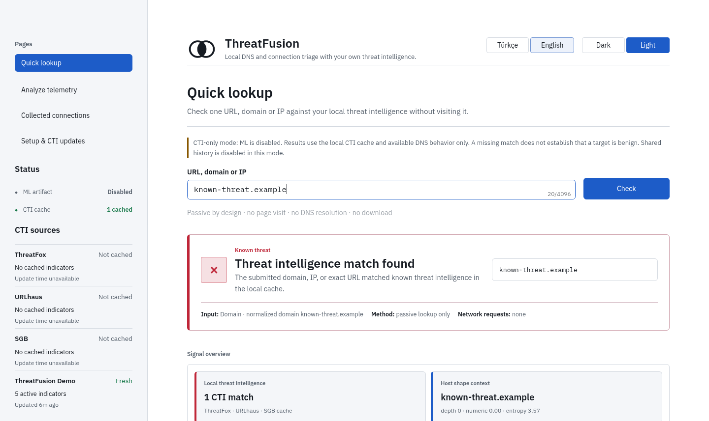
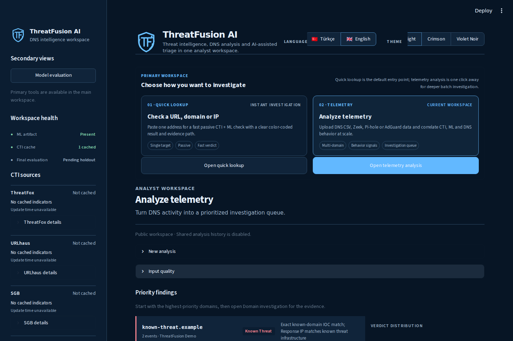
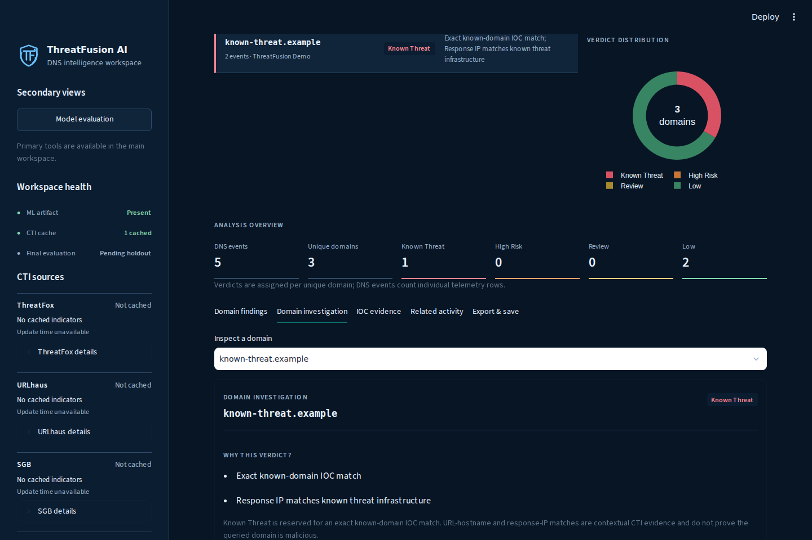

# 🛡️ ThreatFusion AI

### Yerel odaklı siber tehdit istihbaratı, ağ telemetrisi triyajı ve açıklanabilir ML

  <a href="README.md"><strong>🇬🇧 English README</strong></a>
  &nbsp;•&nbsp;
  <strong>🇹🇷 Türkçe README</strong>

  
  
  
  
  
  

  
  
  
  

<strong>ThreatFusion AI, herkese açık tehdit istihbaratını ve yerel telemetriyi bir araya getirerek şüpheli hedeflere bağlanmadan analist odaklı bir inceleme kuyruğu üretir.</strong>

---

## ✨ ThreatFusion AI neden var?

Tehdit akışlarını listelemek tek başına analistin asıl sorusunu cevaplamaz:

> **“Benim ortamımda hangi tehditler görüldü ve önce hangisine bakmalıyım?”**

ThreatFusion dört farklı kanıt katmanını tek bir yerel akışta birleştirir:

| Katman | Rol |
| --- | --- |
| 🧭 **Tehdit İstihbaratı** | ThreatFox, URLhaus, PhishTank ve SGB ile deterministik eşleştirme |
| 🧠 **Makine Öğrenmesi** | Daha önce görülmemiş domainler için yardımcı sözcüksel risk sinyali |
| 📡 **Telemetri Davranışı** | DNS hacmi, NXDOMAIN, yanıt-IP değişimi, zamanlama ve istemci yayılımı |
| 🔎 **Analist Bağlamı** | Açıklanabilir sonuçlar, geçmiş incelemeler, suppression ve ilişkili aktivite |

Proje bilinçli olarak **eğitim / portföy amaçlı bir güvenlik analiz prototipi** olarak konumlandırılır. Production SIEM, EDR veya garantili zararlı yazılım tespit ürünü olarak sunulmaz.

### 🤖 Geliştirme yaklaşımı: AI destekli vibe coding

> **Bu proje, yapay zekâ destekli “vibe coding” yaklaşımıyla geliştirildi.** Yapay zekâ araçları hızlı prototipleme, kod geliştirme, refactoring, hata ayıklama, test ve dokümantasyon süreçlerinde yoğun şekilde kullanıldı. Üretilen değişiklikler birleştirilmeden önce gözden geçirildi, test edildi ve iyileştirildi.

---

## 🚀 Kısaca neler yapıyor?

<table>
<tr>
<td width="50%">

### ⚡ Hızlı Sorgu
Bir **URL, domain veya IP** girerek yerel indeksli CTI önbelleğinde kontrol et.

- tamamen pasif
- sayfa ziyareti yok
- DNS çözümlemesi yok
- tam URL / domain / IP kanıtı
- zararlı URL'ler için hostname bağlamı
- yalnız geçerli domain hedeflerinde ML

</td>
<td width="50%">

### 📂 Telemetri Analizi
Ağ veya DNS telemetrisi yükle; ThreatFusion formatı otomatik algılar.

- IOC korelasyonu
- açıklanabilir hibrit sonuç
- domain ML skoru
- DNS davranış sinyalleri
- ilişkili aktivite kümeleri
- mahremiyet dostu rapor dışa aktarma

</td>
</tr>
<tr>
<td width="50%">

### 🗃️ Çok Kaynaklı CTI
Kaynak güncelliği, lifecycle geçmişi ve indeksli sorgu desteğine sahip yerel SQLite önbellek.

- ThreatFox
- URLhaus
- PhishTank — doğrulanmış ve çevrimiçi
- T.C. Siber Güvenlik Başkanlığı (SGB)

</td>
<td width="50%">

### 🧪 Tekrarlanabilir ML
Character n-gram TF-IDF + Logistic Regression; dondurulmuş artifact ve açık FPR bütçeleri.

- train / validation / test ayrımı
- kaynak bazlı tanılama
- fresh holdout iş akışı
- otomatik model promotion yok
- skorlar “malware olasılığı” diye sunulmaz

</td>
</tr>
</table>

---

## 🖼️ Arayüz önizlemesi

> Ekran görüntüleri gerçek Streamlit arayüzünden, **sentetik public-demo runtime** kullanılarak alınmıştır. Canlı CTI anahtarı, özel telemetri veya kişisel veri gösterilmez.

### ⚡ Pasif Hızlı Sorgu

  

### 📡 Telemetri analiz genel görünümü

  

### 🔎 Kanıt odaklı domain incelemesi

  

---

## 🧩 Mimari

~~~mermaid
flowchart LR
    subgraph CTI["Tehdit İstihbaratı"]
        TF[ThreatFox]
        UH[URLhaus]
        PT[PhishTank]
        SGB[SGB]
    end

    subgraph INPUT["Telemetri"]
        CSV[CSV / TSV / TXT]
        XLS[Excel]
        ZEEK[Zeek dns.log / conn.log]
        PCAP[PCAP / PCAPNG]
        SURI[Suricata EVE]
        PI[Pi-hole]
        AG[AdGuard Home]
        DST[dnstop]
    end

    TF --> CACHE[(SQLite CTI Önbelleği)]
    UH --> CACHE
    PT --> CACHE
    SGB --> CACHE

    CSV --> INGEST[Otomatik algılama + normalizasyon]
    XLS --> INGEST
    ZEEK --> INGEST
    PCAP --> INGEST
    SURI --> INGEST
    PI --> INGEST
    AG --> INGEST
    DST --> INGEST

    CACHE --> ANALYZE[Runtime Analizi]
    INGEST --> ANALYZE
    MODEL[Dondurulmuş ML Artifact] --> ANALYZE

    ANALYZE --> IOC[IOC Kanıtı]
    ANALYZE --> ML[ML Sinyali]
    ANALYZE --> DNS[Davranış Sinyalleri]

    IOC --> VERDICT[Açıklanabilir Hibrit Sonuç]
    ML --> VERDICT
    DNS --> VERDICT

    VERDICT --> UI[Streamlit Analist Çalışma Alanı]
    VERDICT --> REPORT[Mahremiyet Dostu JSON / CSV]
~~~

### Kanıt önceliği

ThreatFusion tüm sinyalleri aynı güçte kabul etmez.

1. **Tam bilinen IOC eşleşmesi** deterministik kanıttır.
2. **URL-hostname / response-IP eşleşmeleri** bağlamsal CTI kanıtıdır.
3. **ML**, CTI'da bulunmayan uygun domainler için yardımcı sinyaldir.
4. **Davranış heuristikleri** bağlam veya inceleme sinyali üretir; tek başına zararlı yazılım kanıtı değildir.

Bu ayrım projenin temel tasarım prensiplerinden biridir.

---

## 📥 Desteklenen telemetri formatları

Dashboard varsayılan olarak **Otomatik algıla** modunda çalışır.

| Girdi | Destek | Not |
| --- | :---: | --- |
| CSV / TSV / TXT | ✅ | ayraç, encoding ve DNS sütunları otomatik tahmin edilir |
| XLSX / XLS | ✅ | worksheet ve yaygın DNS sütunları otomatik algılanır |
| Zeek <code>dns.log</code> | ✅ | standart <code>#fields</code> parser |
| Zeek <code>conn.log</code> | ✅ | hedef-IP CTI analizi; veri setindeki hazır etiketler kullanılmaz |
| PCAP / PCAPNG / CAP | ✅ | klasik UDP/53 DNS çıkarımı |
| Suricata EVE JSON / JSONL | ✅ | DNS öncelikli, hedef-IP fallback |
| Pi-hole FTL SQLite | ✅ | query veritabanı bellekte işlenir |
| AdGuard Home | ✅ | query-log JSON formatları |
| dnstop metni | ✅ | tanınabilir domain satırları |
| <code>.capinfos</code> | ℹ️ | metadata olarak tanınır; orijinal PCAP/PCAPNG yüklenmelidir |

**Dosya yükleme sınırı:** 100 MB  
**Runtime güvenlik sınırları:** 100.000 event ve 25.000 benzersiz analiz hedefi.

PCAP üzerinden DoH/DoT gibi şifreli DNS'ten domain çıkarıldığı iddia edilmez.

---

## 🧠 Makine öğrenmesi yaklaşımı

ThreatFusion “AI” katmanını kara kutu gibi kullanmaz:

**character 2–6 TF-IDF → balanced Logistic Regression → dondurulmuş eşikler**

ML sinyali özellikle **daha önce görülmemiş domain adları** için tasarlanmıştır ve deterministik CTI kanıtından bilinçli olarak daha düşük önceliktedir.

Önemli sınırlar:

- model çıktısı **kalibre edilmiş olasılık değildir**;
- model otomatik olarak production varsayılanına yükseltilmez;
- false-positive rate ve recall ayrı ayrı ölçülür;
- mevcut C=4 adayının son post-freeze temporal değerlendirmesi release öncesi kalan iştir;
- proje “kusursuz tespit” iddiasında bulunmaz.

Ayrıntılı metodoloji: **[docs/ML_DATASET.md](docs/ML_DATASET.md)**.

---

## 🔐 Mahremiyet ve güvenlik tasarımı

ThreatFusion şüpheli göstergeleri **pasif veri** olarak işler.

- yüklenen telemetri varsayılan olarak yerel / bellekte işlenir;
- ham telemetri satırları analiz geçmişine kaydedilmez;
- taşınabilir raporlara ham istemci ve response IP değerleri eklenmez;
- Hızlı Sorgu URL açmaz, hostname çözmez ve içerik indirmez;
- public mode ortak analiz geçmişini kapatır;
- üçüncü taraf CTI dump'ları repoya commit edilmez;
- public demo için sanitize edilmiş runtime oluşturulur;
- feed yenileme hatasında son sağlıklı snapshot korunur.

---

## 🔄 CTI güncelleme mekanizması

ThreatFusion kullanıcı sorgusunu feed yenilemesinden ayırır.

~~~text
ThreatFox / URLhaus / SGB  -> eskiyse yenilenir
PhishTank                  -> en fazla 24 saatte bir
başarısız / boş refresh    -> eski sağlıklı snapshot korunur
inactive lifecycle satırı  -> 90 gün sonra temizlenir
~~~

Manuel yenileme:

~~~powershell
$env:THREATFOX_AUTH_KEY="..."
$env:URLHAUS_AUTH_KEY="..."
python scripts\refresh_cti_cache.py --force
~~~

Düşük maliyetli hosting için isteğe bağlı background refresh:

~~~text
THREATFUSION_AUTO_REFRESH_CTI=1
THREATFUSION_CTI_REFRESH_HOURS=6
THREATFUSION_SGB_MAX_PAGES=100
~~~

Hosted kullanımda ayrı scheduler / maintenance job tercih edilir.

---

## 🖥️ Windows'ta sıfırdan kurulum

Bu adımlar, hiçbir geliştirme aracı kurulu olmayan **Windows 10/11** bilgisayarda **PowerShell** ve **Python 3.12** kullanılarak projeyi çalıştırmak için hazırlanmıştır.

### 1. Git ve Python 3.12'yi kur

PowerShell'i aç ve gerekli araçları yükle:

~~~powershell
winget install --id Git.Git -e --source winget
winget install --id Python.Python.3.12 -e --source winget
~~~

Kurulum bittikten sonra PowerShell'i kapatıp tekrar aç. Ardından kurulumları kontrol et:

~~~powershell
git --version
py -3.12 --version
~~~

> Bilgisayarda `winget` yoksa **Git for Windows** ve **Python 3.12 (64-bit)** sürümünü resmi sitelerinden manuel olarak kur. Python kurulumunda Python Launcher seçeneğini açık bırak. Kurulumdan sonra PowerShell'i yeniden aç.

### 2. ThreatFusion AI projesini indir

~~~powershell
cd $HOME
git clone https://github.com/ConquestorYa/threatfusion-ai.git
cd threatfusion-ai
~~~

### 3. Sanal ortamı oluştur ve bağımlılıkları kur

Aşağıdaki yöntem özellikle `Activate.ps1` kullanmaz. Böylece temiz bir Windows kurulumundaki PowerShell execution policy ayarları kurulumu engellemez.

~~~powershell
py -3.12 -m venv .venv

.\.venv\Scripts\python.exe -m pip install --upgrade pip
.\.venv\Scripts\python.exe -m pip install -r requirements.txt
.\.venv\Scripts\python.exe -m pip install --no-deps -e .
~~~

İstersen kurulumu kontrol et:

~~~powershell
.\.venv\Scripts\python.exe -c "import threatfusion, streamlit; print('ThreatFusion install OK')"
~~~

### 4. İlk çalıştırma — güvenli sentetik demo

Önce yerel demo veritabanını ve demo ML artifact'ını oluştur:

~~~powershell
.\.venv\Scripts\python.exe scripts\generate_public_demo_runtime.py --output-dir runtime
~~~

Ardından mevcut PowerShell oturumu için gerekli ayarları yap. SHA-256 değeri oluşturulan artifact dosyasından otomatik okunur:

~~~powershell
$env:THREATFUSION_PUBLIC_MODE="1"
$env:THREATFUSION_DB_PATH="runtime\threatfusion.sqlite"
$env:THREATFUSION_MODEL_DIR="runtime\models\development-001"
$env:THREATFUSION_MODEL_SHA256=(Get-Content "runtime\models\development-001\artifact.sha256" -Raw).Trim()
~~~

Web arayüzünü başlat:

~~~powershell
.\.venv\Scripts\python.exe -m streamlit run streamlit_app.py
~~~

Streamlit normalde tarayıcıyı otomatik açar. Açılmazsa tarayıcıdan **http://localhost:8501** adresine git. Sunucuyu kapatmak için terminalde **Ctrl+C** kullan.

Oluşturulan runtime yalnızca **sentetik dokümantasyon CTI verileri ve demo-only ML artifact** içerir. Arayüzü güvenli şekilde göstermek içindir; model performansı iddiası için kullanılmamalıdır.

### 5. Daha sonra tekrar çalıştırmak

Bağımlılıkları yeniden kurmana gerek yok. PowerShell'i aç, proje klasörüne gir, runtime değişkenlerini yeniden ayarla ve Streamlit'i başlat:

~~~powershell
cd $HOME\threatfusion-ai

$env:THREATFUSION_PUBLIC_MODE="1"
$env:THREATFUSION_DB_PATH="runtime\threatfusion.sqlite"
$env:THREATFUSION_MODEL_DIR="runtime\models\development-001"
$env:THREATFUSION_MODEL_SHA256=(Get-Content "runtime\models\development-001\artifact.sha256" -Raw).Trim()

.\.venv\Scripts\python.exe -m streamlit run streamlit_app.py
~~~

Sentetik runtime'ı bilerek baştan oluşturmak istersen:

~~~powershell
.\.venv\Scripts\python.exe scripts\generate_public_demo_runtime.py --output-dir runtime --overwrite
~~~

### 6. CTI veritabanını manuel güncelleme

Streamlit web uygulaması artık açılış sırasında internete bağlanıp CTI yenilemesi yapmaz. Böylece site doğrudan ve basit şekilde açılır.

ThreatFox ve URLhaus API/auth anahtarlarını environment variable olarak kullanır. Anahtarları Git'e ekleme:

~~~powershell
$env:THREATFOX_AUTH_KEY="YOUR_THREATFOX_KEY"
$env:URLHAUS_AUTH_KEY="YOUR_URLHAUS_KEY"
~~~

Sitenin kullandığı CTI veritabanını tek komutla güncelle:

~~~powershell
.\.venv\Scripts\python.exe update_cti_database.py
~~~

Bu güncelleyici yapılandırılmış ThreatFox, URLhaus ve SGB kaynaklarını zorunlu yeniler. PhishTank, public feed için sabit 24 saatlik minimum yenileme aralığını korur. ThreatFox/URLhaus anahtarı eksikse o kaynak atlanır; SGB ve PhishTank güncellenmeye devam eder. Bir kaynak hata verirse önceki sağlam cache korunur.

Ardından siteyi ayrı olarak başlat:

~~~powershell
.\.venv\Scripts\python.exe -m streamlit run streamlit_app.py
~~~

Streamlit'i başlatmak **veritabanını güncellemez ve dış CTI servislerini beklemez**. Güncel veri istediğinde `update_cti_database.py` dosyasını çalıştırman yeterlidir.

### Windows sorun giderme

- **`py` komutu bulunamıyor:** Python kurulumundan sonra PowerShell'i kapatıp yeniden aç. Sorun devam ederse Python 3.12'yi Python Launcher açık olacak şekilde yeniden kur.
- **`git` komutu bulunamıyor:** Git kurulumundan sonra PowerShell'i kapatıp yeniden aç.
- **`runtime` zaten var hatası:** mevcut runtime'ı kullan veya baştan üretmek için `--overwrite` seçeneğini kullan.
- **8501 portu kullanımda:** son Streamlit komutuna `--server.port 8502` ekle.

---

## 🧰 Teknoloji yığını

  
  
  
  
  
  
  
  

---

## ✅ Kalite kontrolleri

GitHub Actions ilgili push ve pull request'lerde projeyi otomatik kontrol eder:

- **Ubuntu:** Ruff, pytest + coverage, public-release audit, <code>pip-audit</code>
- **Windows / Python 3.12:** tam pytest uyumluluğu
- **Docker:** image build, public-mode açılışı ve Streamlit health check

---

## 🗂️ Proje yapısı

~~~text
threatfusion-ai/
├── src/threatfusion/        # Ana Python paketi
│   ├── collectors/          # CTI collector'ları
│   ├── ...                  # Matching, ML, behavior, persistence, UI yardımcıları
├── scripts/                 # Refresh, evaluation, demo ve release araçları
├── tests/                   # Unit + integration + Streamlit regresyon testleri
├── docs/                    # Mimari, veri kaynakları, ML ve deployment belgeleri
├── streamlit_app.py         # Analist web arayüzü
├── Dockerfile               # Non-root container
└── pyproject.toml           # Paket metadata'sı
~~~

---

## 📚 Dokümantasyon

| Belge | İçerik |
| --- | --- |
| **[Dokümantasyon merkezi](docs/README.md)** | Teknik belgeler için başlangıç noktası |
| **[Mimari](docs/ARCHITECTURE.md)** | Veri akışı, bileşenler ve güven sınırları |
| **[Veri kaynakları](docs/DATA_SOURCES.md)** | Attribution, kaynak kapsamı ve redistribution notları |
| **[ML veri seti ve değerlendirme](docs/ML_DATASET.md)** | Model metodolojisi ve değerlendirme geçmişi |
| **[Deployment](docs/DEPLOYMENT.md)** | Public mode, Docker, refresh job'ları ve hosting |
| **[Release notları](docs/RELEASE_NOTES_v0.1.0.md)** | v0.1.0 release-candidate kapsamı |

---

## 🎯 Proje durumu

**v0.1.0, üniversite / portföy projesi olarak feature-complete durumdadır.**

Release için kalan işler bilinçli olarak dar tutulmuştur:

- son untouched post-freeze temporal ML ölçümü;
- hosted public-mode demo;
- final release checklist ve GitHub release/tag.

Release öncesinde yeni bir v1 model ailesi veya büyük özellik genişletmesi planlanmamaktadır.

---

## 🧭 Kapsam sınırları

ThreatFusion AI:

- production SIEM değildir;
- EDR değildir;
- otomatik incident-response sistemi değildir;
- bir hedefin zararlı veya zararsız olduğuna dair garanti vermez;
- analist incelemesinin yerine geçmez.

Amaç; **çok kaynaklı CTI mühendisliği, güvenli telemetri ingestion, açıklanabilir ML destekli triyaj, tekrarlanabilir değerlendirme, mahremiyet odaklı tasarım ve release kalitesinde yazılım pratiğini** tek bir tutarlı projede göstermektir.

---

## 📄 Lisans

ThreatFusion AI kaynak kodu **MIT License** ile lisanslanmıştır.

Üçüncü taraf tehdit akışları ve veri setleri kendi kullanım şartlarına tabidir. Ayrıntılar: **[docs/DATA_SOURCES.md](docs/DATA_SOURCES.md)**.

---

### ThreatFusion AI

**Önce CTI kanıtı. ML yardımcı sinyal. Analist bağlamı her zaman görünür.**

<a href="README.md">🇬🇧 English README</a>
&nbsp;•&nbsp;
<a href="docs/README.md">📚 Dokümantasyon</a>

