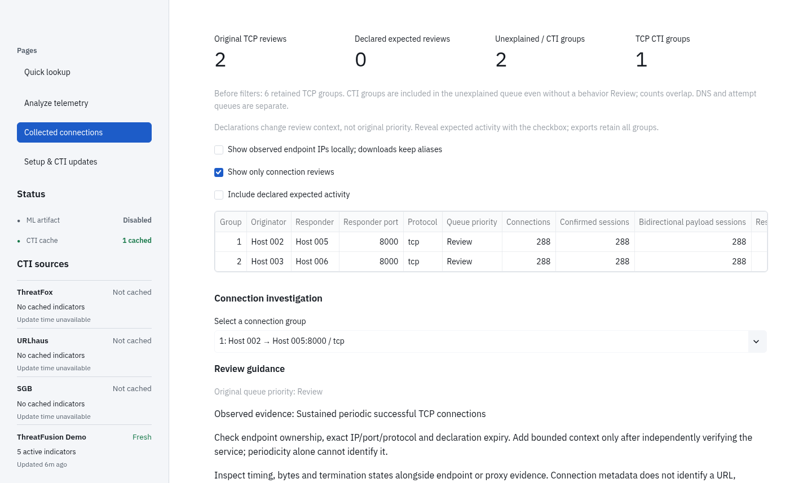
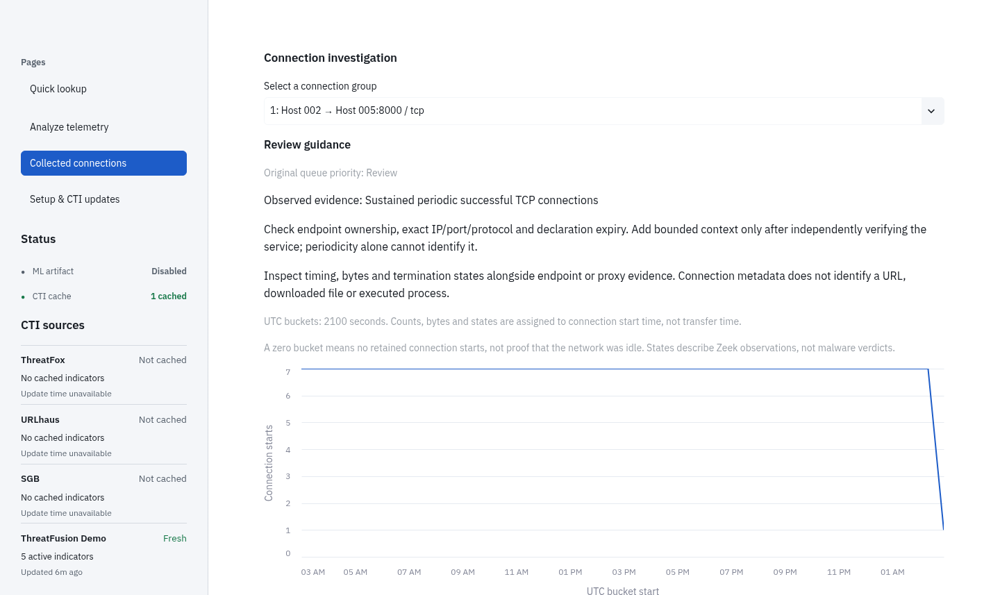
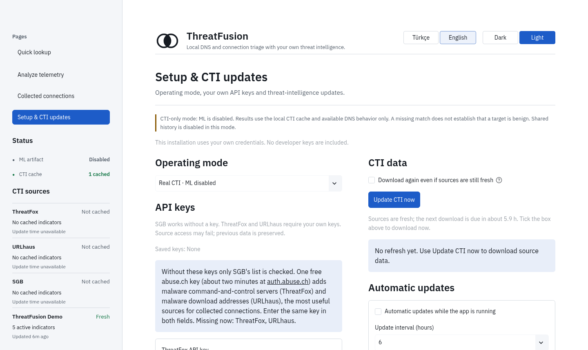

<div align="center">

# ThreatFusion AI

### Zeek kullanıcıları için yerel ağ inceleme aracı

<p>
  <a href="README.md"><strong>English</strong></a>
  &nbsp;•&nbsp;
  <strong>Türkçe</strong>
</p>

<p>
  
  
  
  
  
  
</p>

</div>

ThreatFusion, **Zeek** ağ kayıtlarını okur; her hedefi **tehdit istihbaratı
(CTI) listeleriyle** karşılaştırır ve **zararlı yazılımın "eve haber
vermesine" benzeyen** bağlantıları işaretler. Her işaretin nedenini de söyler.
Kendi Linux bilgisayarında çalışır; trafiğin bilgisayarından dışarı çıkmaz.

> **Durum: erken prototip.** İş akışının tamamı çalışıyor ve geliştiricinin
> sentetik veriyle yaptığı manuel kabul testlerinden geçti. Gerçek trafikle ilk
> test şu an sürüyor. Gerçek zararlı yazılımı ne kadar yakaladığı **henüz
> ölçülmedi.** SIEM, EDR, IDS ya da virüs tarayıcı değildir.

## Ne yapar

Tek bir soruyu cevaplar: **Hangi cihaz hangi hedefle konuştu ve bunlardan
hangilerine daha yakından bakmak gerekir?**

1. **Toplar.** Küçük bir toplayıcı (collector), tamamlanmış her Zeek `conn.log`
   ve `dns.log` dosyasını alır ve son 24 saati saklar.
2. **Kontrol eder.** Her hedef SGB, ThreatFox ve URLhaus listeleriyle
   karşılaştırılır; her cihaz → hedef grubu şüpheli davranış açısından incelenir.
3. **Açıklar.** Bakılması gereken gruplar nedeni, zaman çizelgesi ve bayt
   sayılarıyla **İncele** olarak listelenir. Geri kalan her şey **Gözlem**
   olarak görünür kalır.

| Kontrol | Bir grubu şu durumda işaretler | Tipik neden |
| --- | --- | --- |
| CTI eşleşmesi | Hedef bir CTI listesinde | Bilinen zararlı sunucu |
| Uzun oturum | Tek bir iki yönlü TCP oturumu en az 1 saat sürüyor | Açık tutulan bir kontrol kanalı ya da sohbet/bildirim uygulaması |
| Düzenli tekrar | 30+ dakikada, çok düzenli aralıklarla 20+ bağlantı | Zararlı yazılımın düzenli "haber vermesi" ya da bir güncelleyici |
| Başarısız denemeler | 5 dakika içinde 20+ farklı port/sunucuya ya da 30+ kez tekrarlanan cevapsız/reddedilen deneme | Tarama ya da ulaşılamayan bir sunucuyu deneyip duran bir program |

DNS kayıtları ayrı bir cihaz → alan adı listesinde değerlendirilir (CTI
eşleşmesi, düzenli sorgular, olağandışı hacim). Normal yazılımlar da bu
kurallara uyabilir; liste kanıtı göstererek hızlı karar vermeni sağlar.
Ayrıntılar: [kullanım kılavuzu](docs/USER_GUIDE.md#what-gets-flagged) (İngilizce).

## Ekran görüntüleri

Tüm görüntüler sentetik demo verisiyle, test için ayrılmış adresler ve `.test` alan adlarıyla alınmıştır.

<p align="center">
  
</p>
<p align="center"><em>Toplanan bağlantılar: Zeek kayıtlarından oluşan inceleme listesi.</em></p>

<p align="center">
  
</p>
<p align="center"><em>Bir grubu incelemek: zamana göre bağlantılar, durumlar ve baytlar.</em></p>

<table>
<tr>
<td width="50%"><br><em>Hızlı sorgu: tek bir URL, alan adı ya da IP'yi ziyaret etmeden kontrol et.</em></td>
<td width="50%"><br><em>Kurulum: kendi API anahtarların ve CTI güncellemeleri.</em></td>
</tr>
</table>

## Hızlı başlangıç

**1. Kur** (Linux x86_64; Debian 12 ve Ubuntu 24.04'te test edildi; sudo,
Python ya da Git gerekmez). Normal kullanıcınla çalıştır:

```bash
bash -c 'set -e; f=$(mktemp /tmp/threatfusion-install.XXXXXXXX); trap "rm -f -- \"$f\"" EXIT; u=https://raw.githubusercontent.com/ConquestorYa/threatfusion-ai/main/scripts/install_linux.sh; if command -v curl >/dev/null; then curl --proto "=https" --proto-redir "=https" -fsSL --retry 3 --connect-timeout 20 --max-time 300 "$u" -o "$f"; elif command -v wget >/dev/null; then wget --https-only --timeout=30 --tries=3 -qO "$f" "$u"; else echo "curl veya wget gerekli" >&2; exit 1; fi; bash "$f" "$@"' --
```

Uygulama http://127.0.0.1:8501 adresinde **Kurulum ve CTI güncellemeleri**
sayfasıyla açılır.

**2. CTI ekle.** SGB anahtar istemez. [auth.abuse.ch](https://auth.abuse.ch/)
üzerinden alınan tek bir ücretsiz anahtar hem ThreatFox'u hem URLhaus'u açar.
**CTI'yı şimdi güncelle**'ye bas.

**3. Zeek'i çalıştır;** saatlik bölünmüş `conn.log` ve `dns.log` dosyaları
yazsın: [Zeek sensör kurulumu](docs/ZEEK_SETUP.md) (sürümü sabitlenmiş bir Docker tarifi, İngilizce).

**4. Toplayıcıyı başlat;** ikinci bir terminalde çalıştır ve **Toplanan
bağlantılar** sayfasını aç:

```bash
threatfusion-ai collect --input-dir ~/zeek-sensor/logs
```

Sonra: `threatfusion-ai` uygulamayı yeniden açar, `threatfusion-ai stop`
durdurur. Ayrıntılar: [Linux kurulumu](docs/INSTALL_LINUX.md).

## Uygulamadaki diğer araçlar

- **Hızlı sorgu:** Tek bir URL, alan adı ya da IP'yi CTI önbelleğinde ara.
  Sayfa açılmaz, DNS sorgusu yapılmaz, hiçbir şey indirilmez.
- **Telemetriyi analiz et:** Tek seferlik analiz için bir dosya yükle (Zeek,
  DNS CSV/Excel, PCAP, Suricata EVE, Pi-hole, AdGuard Home, dnstop).
- **Demo modu** (`threatfusion-ai --mode demo`): Arayüzü denemek için sentetik
  veri. Sonuçları ölçüm değildir.

Deneysel bir makine öğrenmesi (alan adı puanı) modeli var ama **kapalı**:
ölçülmüş orijinal model elde değil, yerine aday olan model de çok fazla yanlış
alarm verdi ([değerlendirme geçmişi](docs/evidence/ML_DATASET.md)).

## Gizlilik

- Zeek yalnızca bağlantı ve DNS üst bilgisini kaydedecek şekilde ayarlanır;
  sayfa adresleri, şifreler ya da içerik kaydedilmez. DNS adları yine de hangi
  sitelere girdiğini gösterir; kayıtları gizli tut.
- Kayıtlar, toplayıcı verisi, CTI önbelleği ve anahtarlar bilgisayarındaki
  özel klasörlerde kalır. Hiçbir şey yüklenmez. İndirilen raporlar varsayılan
  olarak takma ad (`Host 1`) kullanır.
- Şüpheli hedefler hiçbir zaman ziyaret edilmez ya da çözümlenmez.
- Kendi API anahtarlarını kullanırsın; projede hiçbir anahtar gelmez.

## Şimdiye kadarki kanıtlar

| Ölçülen | Sonuç |
| --- | --- |
| Sentetik normal ve simüle trafik | Normal güncelleyiciler ve yoklamalar da İncele'ye düşüyor: kurallar henüz yeterince seçici değil ([inceleme yükü](docs/evidence/REVIEW_WORKLOAD.md)) |
| Dört bağımsız IoT-23 kaydı (2018–2019) | İki zararsız kayıtta 0 inceleme; iki zararlı kayıttan biri bir inceleme üretti, diğeri hiç üretmedi ([ağ değerlendirmesi](docs/evidence/NETWORK_EVALUATION.md)) |
| Hata matrisi, 6 saatlik dayanıklılık testi, güvenlik incelemeleri | 9/9 hata senaryosu geçti; ilk dayanıklılık testi bir bellek kontrolünde kaldı (düzeltildi, yeniden ölçülüyor); iki güvenlik incelemesi ([operasyonel güven](docs/evidence/OPERATIONAL_CONFIDENCE.md)) |
| **Henüz ölçülmedi** | Gerçek trafikte yanlış alarm (sürüyor), etiketli gerçek zararlı yazılımı yakalama, başka kullanıcılar için faydası |

Plan: [gerçek trafik değerlendirmesi](docs/evidence/REAL_TRAFFIC_EVALUATION.md).
Tüm kayıtlar: [dokümantasyon](docs/README.md#evidence).

## Benzer araçlar

[RITA](https://github.com/activecm/rita), Zeek kayıtlarında düzenli tekrar ve
uzun bağlantıları bulur; ThreatFusion'ın karşılaştırıldığı temel araçtır.
[Security Onion](https://securityonion.net/) ve [Malcolm](https://github.com/cisagov/Malcolm)
eksiksiz izleme platformlarıdır; [Suricata](https://suricata.io/) bilinen saldırı
imzalarını yakalar. ThreatFusion daha küçük olmayı hedefler: CTI'yı (Türkiye'nin
SGB listesi dahil) açıklanabilir davranış kontrolleriyle birleştiren tek bir
yerel uygulama. Bu araçlardan daha faydalı olup olmadığı ölçülmedi.

## Dokümantasyon

[Kullanım kılavuzu](docs/USER_GUIDE.md) · [Zeek kurulumu](docs/ZEEK_SETUP.md) ·
[Kurulum](docs/INSTALL_LINUX.md) · [Mimari](docs/ARCHITECTURE.md) ·
[Veri kaynakları](docs/DATA_SOURCES.md) · [Kanıtlar](docs/README.md#evidence) ·
[Ürün planı](docs/dev/PRODUCT_PLAN.md) (dokümanlar İngilizce)

## Geliştirme

Python 3.12, Streamlit, SQLite, pandas, Plotly. CI; kod denetimi, testler,
deponun gizlilik denetimi, Windows uyumluluk testleri, konteyner kontrolü ve
Debian ile Ubuntu'da sıfırdan kurulum testlerini çalıştırır.

Bu proje yoğun yapay zekâ desteğiyle geliştiriliyor (tasarım, kod, test ve
dokümantasyon); değişiklikler birleştirilmeden önce gözden geçirilir ve test edilir.

## Lisans

MIT. CTI kaynakları ve veri setleri kendi koşullarına tabidir; bkz.
[veri kaynakları](docs/DATA_SOURCES.md).
