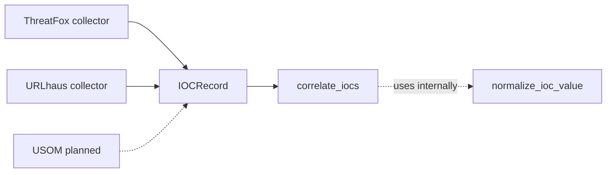
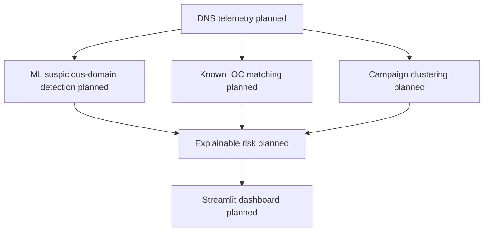

# Architecture

This document distinguishes the current implementation from the planned system. The current architecture ends at correlated IOC groups and two feed collectors. The downstream DNS, ML, campaign, risk, and dashboard components are planned only.

## Current Data Flow

ThreatFox and URLhaus are implemented external sources that produce `IOCRecord` objects. USOM is shown as a planned source and does not currently have a collector. `correlate_iocs()` performs grouping and internally uses `normalize_ioc_value()` to compute canonical comparison values. It groups equivalent records while retaining all original evidence records; it does not rewrite all `IOCRecord` objects through a separate normalization pipeline.

## Planned Analysis and Presentation Flow

The planned flow is not available in the current codebase. In particular, there is no DNS telemetry importer, known-IOC matcher, ML detector, campaign clustering implementation, risk scorer, database, or Streamlit application yet.

## Current Modules

### `src/threatfusion/models.py`

- Defines `IOCType` for supported indicator categories.
- Defines the `IOCRecord` dataclass and its optional timestamps, threat type, confidence, and tags.

### `src/threatfusion/normalization.py`

- Provides canonical IOC value normalization.
- Lowercases and removes one trailing dot from domains.
- Lowercases hashes.
- Uses Python's `ipaddress` module for IPv4 and IPv6 values.
- Strips surrounding whitespace from URLs and unknown values without making network requests.

### `src/threatfusion/correlation.py`

- Defines `IOCGroup` for a correlated canonical value and its original records.
- Provides `correlate_iocs()`.
- Groups records only when both normalized value and `IOCType` match.
- Preserves every original `IOCRecord`, including duplicate evidence from one source.

### `src/threatfusion/collectors/threatfox.py`

- Integrates with the ThreatFox Community API for recent IOCs.
- Uses an injected or real `requests.Session` and an Auth-Key header.
- Maps supported domains, URLs, hashes, and valid IPv4/IPv6 `ip:port` values into `IOCRecord` objects.
- Parses optional timestamps and tags conservatively.

### `src/threatfusion/collectors/urlhaus.py`

- Downloads the URLhaus recent CSV export from the official export endpoint.
- Detects named CSV headers, including comment-prefixed headers, and ignores metadata comments.
- Maps valid URL rows into `IOCRecord` objects with timestamps, threat fields, and tags.
- Treats dataset URLs as text only; it does not follow them and sanitizes authenticated request errors.

## Tests and Tooling

The repository uses `pytest.ini` to expose the `src` layout to pytest. The test suite covers the implemented model, normalization, correlation, ThreatFox, and URLhaus behavior. Ruff is used for lint checks. Collector tests inject fake sessions and do not make real feed requests.

## Planned Stack

The planned technology stack is:

- Python 3.12.
- pandas.
- scikit-learn.
- Streamlit.
- Plotly.
- SQLite.
- pytest.
- Ruff.

The stack describes project direction; it does not mean that every planned component is currently implemented or wired into the application.