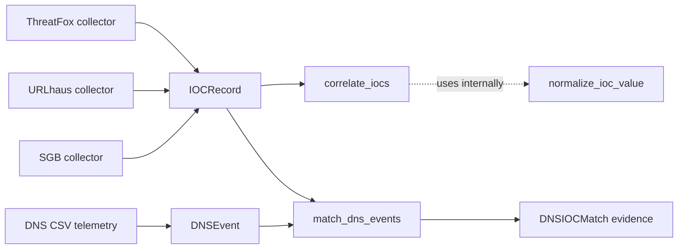
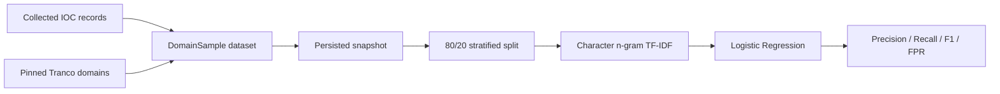
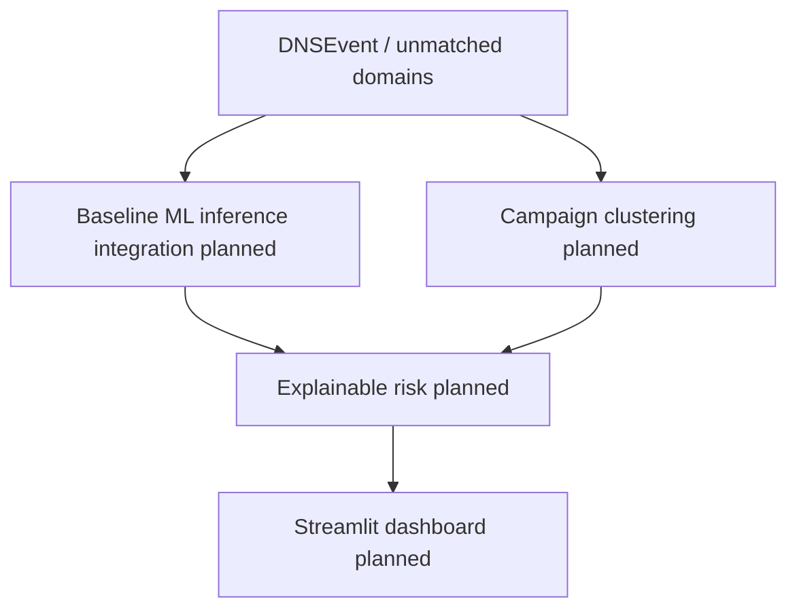

# Architecture

This document distinguishes the current implementation from the planned system. The current architecture includes IOC collection, correlation, DNS telemetry ingestion, in-memory matching against known indicators, reproducible ML dataset snapshots, and a baseline malicious-domain classifier. Campaign, risk, dashboard, and runtime DNS-to-ML integration remain planned.

## Current Data Flow

ThreatFox, URLhaus, and SGB are implemented external sources that produce `IOCRecord` objects. `correlate_iocs()` performs grouping and internally uses `normalize_ioc_value()` to compute canonical comparison values. It groups equivalent records while retaining all original evidence records; it does not rewrite all `IOCRecord` objects through a separate normalization pipeline.

The DNS ingestion layer parses CSV telemetry into `DNSEvent` objects without performing any network lookup or resolution. The matching layer then compares normalized DNS queries and response IPs against known IOC records while preserving the original `DNSEvent` and `IOCRecord` evidence objects.

The matcher currently supports:

- DOMAIN -> DNS query_name
- URL hostname -> DNS query_name
- IPv4 / IPv6 -> DNS response_ip

Normalization is used for comparison only. URL IOC values are parsed locally with `urllib.parse` and are never visited or resolved. Matching is in-memory and performs no network activity.

## Current ML Development Flow

The baseline vectorizer and classifier are fitted after splitting, so held-out
test domains do not influence TF-IDF fitting. The current random stratified
split is explicitly a development baseline rather than the final evaluation
protocol.

## Planned Analysis and Presentation Flow

Runtime integration of the classifier with unmatched DNS observations,
source-aware/time-aware evaluation, campaign clustering, explainable risk,
SQLite persistence, and the Streamlit dashboard are not implemented yet.

## Current Modules

### `src/threatfusion/models.py`

- Defines `IOCType` for supported indicator categories.
- Defines the `IOCRecord` dataclass and its optional timestamps, threat type, confidence, and tags.

### `src/threatfusion/normalization.py`

- Provides canonical IOC value normalization.
- Lowercases and removes one trailing dot from domains.
- Lowercases hashes.
- Uses Python's `ipaddress` module for IPv4 and IPv6 values.
- Strips surrounding whitespace from URLs and unknown values without making network requests.

### `src/threatfusion/correlation.py`

- Defines `IOCGroup` for a correlated canonical value and its original records.
- Provides `correlate_iocs()`.
- Groups records only when both normalized value and `IOCType` match.
- Preserves every original `IOCRecord`, including duplicate evidence from one source.

### `src/threatfusion/dns.py`

- Defines `DNSEvent` for a DNS observation with optional timestamp, client IP, query type, and response IP.
- Provides `parse_dns_csv()` for safe CSV ingestion using the Python standard library.
- Accepts the project CSV schema: `timestamp,client_ip,query_name,query_type,response_ip`.
- Preserves `query_name` evidence exactly as observed, while trimming surrounding whitespace.
- Validates canonical response IP values with Python's `ipaddress` module and keeps malformed values as `None`.
- Performs no network operations, DNS lookups, or external requests while parsing telemetry.

### `src/threatfusion/matching.py`

- Defines `DNSIOCMatch` for a matched DNS event and IOC record with a simple match type.
- Provides `match_dns_events()` for local in-memory matching.
- Builds lightweight lookup indexes instead of performing a naive full nested scan.
- Matches DOMAIN IOC values against normalized DNS query names.
- Matches URL IOC hostnames against DNS query names using local parsing only.
- Matches IPv4 and IPv6 IOC values against `DNSEvent.response_ip` values.
- Preserves original `DNSEvent` and `IOCRecord` objects as evidence.
- Ignores malformed IOC values without breaking the whole batch.
- Ignores unsupported hash and `UNKNOWN` IOC types for DNS matching.

### `src/threatfusion/ml_dataset.py`

- Extracts normalized malicious domain samples from DOMAIN and URL IOC records.
- Builds benign samples from caller-supplied domain strings.
- Deduplicates at normalized-domain level and gives malicious labels precedence on overlap.

### `src/threatfusion/ml_split.py`

- Provides the deterministic 80/20-style stratified development split.
- Rejects duplicate/conflicting normalized domains and preserves original sample objects.
- Uses a fixed default `random_state=42`.

### `src/threatfusion/ml_snapshot.py` and `ml_snapshot_io.py`

- Assemble reproducible in-memory dataset snapshots with aggregate statistics.
- Persist exact local `dataset.csv` and `metadata.json` experiment snapshots.
- Keep local snapshot data outside Git through `data/snapshots/`.

### `src/threatfusion/ml_baseline.py`

- Builds character 3-5 gram TF-IDF features and a Logistic Regression classifier.
- Fits only on the training side of the existing stratified split.
- Reports precision, recall, F1, false-positive rate, and TN/FP/FN/TP counts.
- Performs no networking and does not depend on live CTI collection during training.

### `src/threatfusion/ml_high_recall.py`

- Uses the same character TF-IDF representation with `class_weight="balanced"`.
- Creates deterministic train, validation, and development-test partitions.
- Fits the representation and classifier on train only.
- Selects operating thresholds on validation only for requested recall targets.
- Measures the selected thresholds on the development-test partition.
- Reports the precision/recall/F1/false-positive tradeoff instead of claiming guaranteed perfect detection.

### `src/threatfusion/ml_fpr_comparison.py`

- Compares three predefined classical text-classification candidates.
- Reuses one shared deterministic train/validation/development-test split.
- Selects candidate thresholds on validation only under explicit false-positive-rate budgets.
- Maximizes recall subject to each validation false-positive-rate limit.
- Applies each selected threshold to the shared development-test split.
- Uses no networking and adds no third-party dependency beyond the existing scikit-learn stack.

### `src/threatfusion/collectors/threatfox.py`

- Integrates with the ThreatFox Community API for recent IOCs.
- Uses an injected or real `requests.Session` and an Auth-Key header.
- Maps supported domains, URLs, hashes, and valid IPv4/IPv6 `ip:port` values into `IOCRecord` objects.
- Parses optional timestamps and tags conservatively.

### `src/threatfusion/collectors/urlhaus.py`

- Downloads the URLhaus recent CSV export from the official export endpoint.
- Detects named CSV headers, including comment-prefixed headers, and ignores metadata comments.
- Maps valid URL rows into `IOCRecord` objects with timestamps, threat fields, and tags.
- Treats dataset URLs as text only; it does not follow them and sanitizes authenticated request errors.

### `src/threatfusion/collectors/sgb.py`

- Integrates with the official T.C. Siber Guvenlik Baskanligi malicious-address API.
- Performs single-page bounded fetching through a one-based public `page` argument.
- Maps domains, URLs, IPv4, and IPv6 indicators into `IOCRecord` objects.
- Handles IPv6 networks conservatively as `IOCType.UNKNOWN` because the current model represents host IPs, not networks.
- Treats returned IOC values only as data and never requests them.

## Tests and Tooling

The repository uses `pytest.ini` to expose the `src` layout to pytest. The test suite covers the implemented model, normalization, correlation, collectors, DNS ingestion, matching, ML dataset preparation, splitting, snapshot persistence, and baseline model evaluation. Ruff is used for lint checks. Collector tests inject fake sessions and do not make real feed requests. GitHub Actions runs Ruff and pytest automatically on pull requests and pushes to `main`.

## Planned Stack

The planned technology stack is:

- Python 3.12.
- pandas.
- scikit-learn.
- Streamlit.
- Plotly.
- SQLite.
- pytest.
- Ruff.

The stack describes project direction; it does not mean that every planned component is currently implemented or wired into the application.